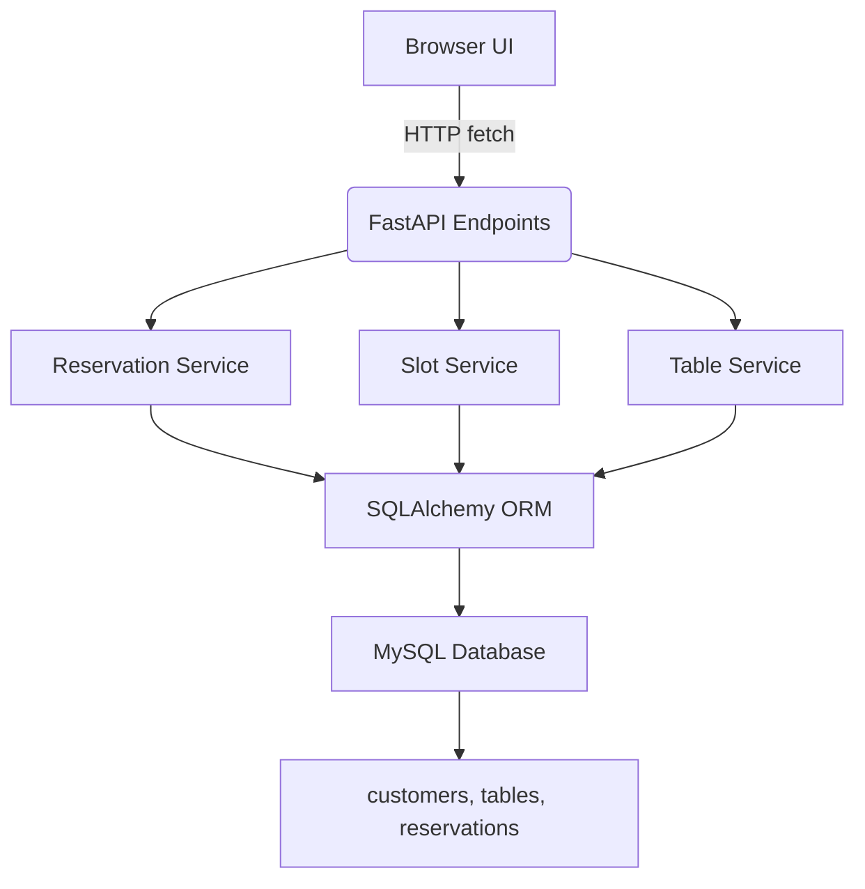
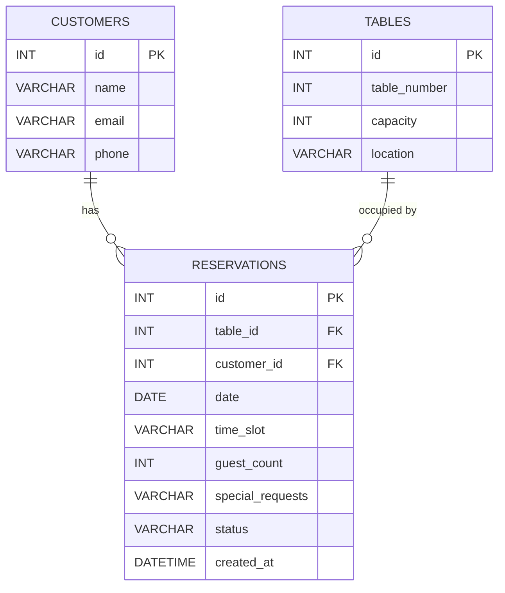

# Restaurant Reservation System
# Reservation API Project Walkthrough

## 1. Project Overview

This project is a restaurant reservation platform with:
- FastAPI backend (`app/`)
- SQLAlchemy ORM with MySQL persistence
- Alembic migrations management
- Plain JS frontend (`frontend/index.html`) for quick interaction

Main use cases:
- Register tables
- Check availability by date/time slot
- Create reservations
- Get/cancel reservations

---

## 2. Architecture Summary

- **app/main.py**: FastAPI app setup, router include, CORS
- **app/routers**: API endpoints
  - `tables.py`: list/add tables
  - `reservations.py`: availability/reserve/get/cancel
- **app/services**: business logic
  - `slot_service.py`: availability computation
  - `reservation_service.py`: booking and cancellation rules
  - `table_service.py`: CRUD operations for tables
- **app/models**: SQLAlchemy models for customers, tables, reservations
- **app/schemas**: Pydantic contract for request/response
- **app/database.py**: DB engine + SessionLocal + Base class
- **alembic/**: migrations, `versions` scripts
- **frontend/index.html**: UI with API calls and table rendering

### Architecture Diagram



---

## 3. Database Schema

### Tables

- `customers`
  - `id`: INT PK AUTO_INCREMENT
  - `name`: VARCHAR(100)
  - `email`: VARCHAR(100) UNIQUE
  - `phone`: VARCHAR(20)

- `tables`
  - `id`: INT PK AUTO_INCREMENT
  - `table_number`: INT UNIQUE
  - `capacity`: INT
  - `location`: VARCHAR(50)

- `reservations`
  - `id`: INT PK AUTO_INCREMENT
  - `table_id`: INT FK -> tables.id
  - `customer_id`: INT FK -> customers.id
  - `date`: DATE
  - `time_slot`: VARCHAR(10)
  - `guest_count`: INT
  - `special_requests`: VARCHAR(255)
  - `status`: VARCHAR(20) (active / cancelled)
  - `created_at`: DATETIME

### Database Schema Diagram



---

## 4. Deployment Setup

### Requirements
- Python 3.10+
- MySQL and `pymysql`

### Setup MySQL
1. Run `setup_mysql.sql`:
   ```bash
   mysql -u root -p < setup_mysql.sql
   ```
2. Verify:
   ```bash
   mysql -u restaurant_user -ppassword -e "SHOW DATABASES;"
   ```

### Python packages
```bash
python -m pip install -r requirements.txt
```

### Migrations
```bash
alembic upgrade head
```

### Start app
```bash
python run.py
```

### Open API docs
- `http://localhost:8000/docs`

---

## 5. API Reference

### Tables
- `GET /tables/`: list tables
- `POST /tables/`: create table
  - payload: `{ "table_number": 1, "capacity": 2, "location": "indoor"}`

### Availability
- `GET /reservations/available?date=YYYY-MM-DD&time_slot=18:00`
  - `time_slot` optional (filters available times)

### Reservation
- `POST /reservations/`
  - payload sample:
    ```json
    {
      "date": "2026-03-27",
      "time_slot": "18:00",
      "guest_count": 2,
      "customer": { "name": "John Doe", "email": "john@example.com" },
      "table_id": 1
    }
    ```
- `GET /reservations/{reservation_id}`
- `DELETE /reservations/{reservation_id}` (cancels)


---

## 6. Frontend Usage

- Controls:
  - Tables: add + list
  - Availability: choose date + optional time slot
  - Reservation: create/get/cancel
- Output: HTML table rendering (availability and results)
- Set status messages with visual indicator (`success` / `error` / `loading`)

---

## 7. Business Rules

- Only AVAILABLE tables (not reserved for that slot) are listed
- Product supports set times (`18:00`, `20:00`, `22:00`)
- `POST /reservations/` assigns table intelligently if none provided
- `DELETE` sets `status = cancelled`, does not delete
- `Cancellation window` usage in config: `CANCELLATION_WINDOW_HOURS = 2`

---

## 8. Walkthrough Flow

1. Add table(s) from UI
2. Choose date + time, click `Check` to see available tables
3. Book reservation with customer info + optional `table_id`
4. View created reservation and cancel if needed

---

## 9. Key Files

- `app/database.py`
- `app/models/customer.py`, `table.py`, `reservation.py`
- `app/routers/tables.py`, `reservations.py`
- `app/services/*`
- `alembic/versions/a760dcbdba03_initial_tables.py`
- `frontend/index.html`
- `setup_mysql.sql`

---

## 10. Extending the Project

Ideas:
- Add login/auth (OAuth or JWT)
- Add admin role + view reservation history
- Add API pagination
- Add timeslot configuration in DB
- Add email confirmation
- Add proper frontend framework (React/Vue)
